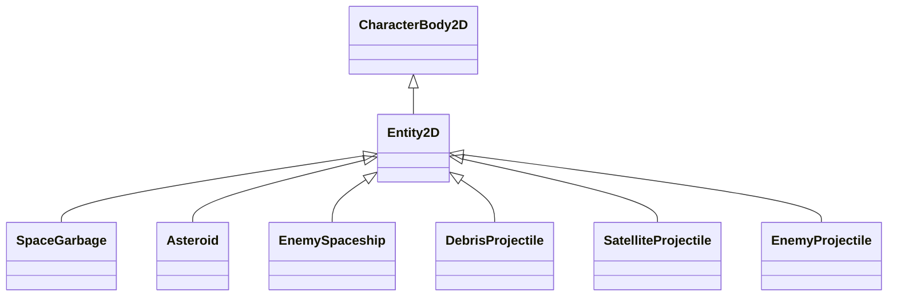

# VearthIncThreat (IdleSpace) - Godot Game Architecture & Code Documentation

This document outlines the core classes, subsystems, and key gameplay mechanics within the **VearthIncThreat** (IdleSpace) Godot 4 project.

---

## 1. Project Overview & Architecture
The game is built in **Godot 4** using a hybrid **2D Simulation with 3D Visual Rendering** approach.
* **Simulation Layer (2D)**: All physics, colliders, movement calculations, and gameplay logic occur on a 2D plane under `World2D`. Entities inherit from `Entity2D` (a custom subclass of `CharacterBody2D`).
* **Visual Layer (3D)**: Visual representations (meshes, lights, particles) are rendered in a 3D viewport under `World3D`. Every 2D entity has a corresponding 3D counterpart, which synchronizes its position and rotation automatically in `_physics_process()`.

### Key Scene Relationships Diagram:
```mermaid
graph TD
    Main[main.tscn] --> GameManager[Autoload: GameManager]
    Main --> UpgradeManager[Autoload: UpgradeManager]
    Main --> ObjectPooler[ObjectPooler Node]
    Main --> CameraController[CameraController Node]
    Main --> World2D[World2D Node2D]
    Main --> World3D[World3D Node3D]
    
    ObjectPooler -- Recycles -- Entity2D
    World2D -- Coordinates Physics -- Entity2D
    World3D -- Renders -- Visual3D
    Entity2D -- Syncs Position to -- Visual3D
```

---

## 2. Autoloads & Global Managers

### `GameManager` (`game_manager.gd`)
Manages game state, run session credits, lifetime bank credits, and game flow triggers.
* **State Machine (`GameState`)**: `PLAYING`, `PAUSED`, `UPGRADE_SCREEN`, `END_SESSION`, `VICTORY`, `TRANSITION`.
* **Properties**:
  - `run_credits`: Credits accumulated in the current run.
  - `lifetime_credits`: Credits saved in the permanent bank (used to buy upgrades).
  - `current_zone`: The current round / difficulty level.
  - `decay_timer` / `decay_time_limit`: Controls planet health decay progression.
  - `debris_chance`: The current probability of spawning debris projectile on threat death.
* **Key Methods**:
  - [change_state](file:///e:/GODOT/vearthIncThreat/src/autoloads/game_manager.gd#L57): Updates game state and handles cleanup (recycles all active actors on PAUSED or END_SESSION).
  - [add_credits](file:///e:/GODOT/vearthIncThreat/src/autoloads/game_manager.gd#L68): Adds credits to `run_credits` scaled by the `ResourceMultiplier` upgrade.
  - [spend_lifetime_credits](file:///e:/GODOT/vearthIncThreat/src/autoloads/game_manager.gd#L75): Deducts credits from permanent bank for purchases.
  - [start_next_round](file:///e:/GODOT/vearthIncThreat/src/autoloads/game_manager.gd#L90): Increments `current_zone`, resets `run_credits`, and reloads the active scene to start a new wave.
  - [reset_game](file:///e:/GODOT/vearthIncThreat/src/autoloads/game_manager.gd#L48): Resets run statistics, zeroes credits, and starts a fresh run.

### `UpgradeManager` (`upgrade_manager.gd`)
Loads and manages the upgrades system.
* **Properties**:
  - `upgrades_list`: Array of all available `UpgradeData` resources.
  - `upgrades_by_id`: Dictionary of upgrades mapped by their unique string IDs.
  - `purchased_levels`: Player's current levels (`{ upgrade_id: int }`).
* **Key Methods**:
  - [load_all_upgrades](file:///e:/GODOT/vearthIncThreat/src/autoloads/upgrade_manager.gd#L22): Dynamically scans `res://src/resources/upgrades/` folder, handles internal Godot `.remap` resource suffixes during export, and loads all `.tres` files.
  - [get_upgrade_level](file:///e:/GODOT/vearthIncThreat/src/autoloads/upgrade_manager.gd#L49): Returns the level of the requested upgrade.
  - [is_upgrade_visible](file:///e:/GODOT/vearthIncThreat/src/autoloads/upgrade_manager.gd#L53): Determines if an upgrade should show in the skill tree (checking if prerequisite upgrades have level > 0).
  - [can_unlock_upgrade](file:///e:/GODOT/vearthIncThreat/src/autoloads/upgrade_manager.gd#L66): Validates if player can purchase the upgrade (checks visibility, current level < max level).
  - [purchase_upgrade](file:///e:/GODOT/vearthIncThreat/src/autoloads/upgrade_manager.gd#L77): Deducts permanent credits and increments upgrade level.
  - [get_multiplier](file:///e:/GODOT/vearthIncThreat/src/autoloads/upgrade_manager.gd#L94): Calculates the cumulative multiplier for a category using additive scaling:
    $$\text{FinalMultiplier} = 1.0 + \sum (\text{IndividualUpgradeMultiplier} - 1.0)$$

---

## 3. Core Framework & Spawning

### `ObjectPooler` (`object_pooler.gd`)
Controls entity memory management by pre-allocating and reusing objects.
* **Pool Types**: `"garbage"`, `"asteroid"`, `"enemy"`, `"debris"`, `"enemy_projectile"`, `"satellite_projectile"`.
* **Key Methods**:
  - [borrow_from_pool](file:///e:/GODOT/vearthIncThreat/src/core/object_pooler.gd#L34): Borrows an entity from the pool (or creates it if empty), attaches it to the 2D and 3D scenes, binds the visual link, and calls `on_pool_activate()`.
  - [return_to_pool](file:///e:/GODOT/vearthIncThreat/src/core/object_pooler.gd#L69): Deactivates the entity (`on_pool_deactivate()`), removes it from the scene, and pushes it back into the list.
  - [return_all_active_to_pool](file:///e:/GODOT/vearthIncThreat/src/core/object_pooler.gd#L98): Forces all active simulation entities back to their respective pools (used when transitioning/resetting).

### `Spawner` (`spawner.gd`)
Orchestrates wave progression, spawning garbage resources, asteroids, and enemy spaceships.
* **Spawning Logic**:
  - Locates path-followers under `SpawnPath` to determine spawn coordinates.
  - Rolls against a random weighted spawn table to decide entity types.
  - Controls spawning rate, limits maximum active entity counts, and increments difficulty based on `current_zone`.

### `SpawnPath` (`spawn_path.gd`)
A customized `Path2D` that draws and generates a spawning ring around the planet.
* **Properties**:
  - `circle_radius` (default `650.0`): The distance from the center planet at which threats spawn.
  - `spawner_count` (default `40`): Number of marker spawn points generated.

---

## 4. Entity Hierarchy & Behaviors



### `Entity2D` (`entity_2d.gd`)
Base class for all interactive 2D physics actors.
* **Key Functions**:
  - [on_pool_activate](file:///e:/GODOT/vearthIncThreat/src/entities/entity_2d.gd#L16): Sets initial values, groups, and positions, activating the 3D mesh.
  - [on_pool_deactivate](file:///e:/GODOT/vearthIncThreat/src/entities/entity_2d.gd#L32): Stops movement and hides visuals.
  - [take_damage](file:///e:/GODOT/vearthIncThreat/src/entities/entity_2d.gd#L44): Reduces HP, spawns 3D damage popup numbers, and calls `die()` if HP <= 0.
  - [die](file:///e:/GODOT/vearthIncThreat/src/entities/entity_2d.gd#L87): Triggers death callback and returns itself to the `ObjectPooler`.
  - [_physics_process](file:///e:/GODOT/vearthIncThreat/src/entities/entity_2d.gd#L102): Synchronizes position to 3D X-Z coordinate plane, and translates 2D rotation to 3D Y-axis rotation.

### `SpaceGarbage` (`space_garbage.gd`)
The main resource entity. Travels inward from the spawn circle towards the planet `(0,0)`.
* **Key Features**:
  - Custom visual scaling (scales visual meshes relative to tier size).
  - Integrates `Massify` category upgrades (doubles HP, value, and collision damage).
  - Linear velocity is halved (`base_speed * 0.5`) when damaged to introduce hit slowdown.
  - Collision with planet shield (`global_position.length() < 45.0`) triggers damage to planet.
  - Grants credits on death and rolls for `DebrisProjectile` burst (requires `DA_UnlockDebrie_T0` to be unlocked).

### `Asteroid` (`asteroid.gd`)
Hostile space rocks that travel inward.
* **Key Features**:
  - Deals collision damage on reaching the planet.
  - Spawns debris projectiles on death if `DA_UnlockDebrie_T0` is unlocked.
  - Can collide with garbage, destroying it without granting credits.

### `EnemySpaceship` (`enemy_spaceship.gd`)
Hostile ships that orbit the planet.
* **Key Features**:
  - Flies inward to reach `orbit_radius` (~180.0 pixels) and then revolves around the center.
  - Fires `EnemyProjectile` towards the planet on a cooldown interval.

### `Satellite` (`satellite.gd`)
Defensive satellites that orbit the planet.
* **Key Features**:
  - Circles the planet at a constant distance.
  - Automatically targets closest threat and fires `SatelliteProjectile`.

### `DebrisProjectile` (`debris_projectile.gd`)
Projectiles spawned on threat deaths.
* **Key Features**:
  - Travels outward from the planet in linear directions.
  - Pierces through multiple threats based on `DebrisPiercing` upgrade.
  - Recycles itself when out of camera boundaries.

---

## 5. Visuals & UI

### `CameraController` (`camera_controller.gd`)
Manipulates the 3D orthographic camera view.
* **Methods**:
  - [_on_trigger_camera_animation](file:///e:/GODOT/vearthIncThreat/src/main/camera_controller.gd#L23): Zooms out the view (increases camera `size`) using a smooth tween when `DA_UnlockAsteroids` is purchased for the first time.

### `SkillTree` (`skill_tree.gd`)
Handles drawing of nodes, connector paths, and buying mechanics.
* **Methods**:
  - [_on_close_pressed](file:///e:/GODOT/vearthIncThreat/src/ui/skill_tree.gd#L124): Resumes playing and progresses to the next wave.
  - [show_tooltip](file:///e:/GODOT/vearthIncThreat/src/ui/skill_tree.gd#L129): Renders details card showing upgrade prices, current bonuses, and labels.

### `UpgradeSlotUI` (`upgrade_slot_ui.gd`)
Individually represents a single upgrade in the tree.
* **Key Custom Sizing & Animations**:
  - The root `PanelContainer` uses `StyleBoxEmpty` (completely transparent background).
  - The `IconButton` uses custom `StyleBoxFlat` with rounded corners (12px) modulated in purple `#39009C` via `self_modulate` to serve as a separate backdrop.
  - `IconRect` (holds the `.png` data asset icon) is sized to be exactly **25% smaller** than the button using `SIZE_SHRINK_CENTER` sizing flags and custom sizes (60x60 inside 80x80 container).
  - When purchased, the `IconButton` (the purple background) spins 405 degrees via a Tween while the `IconRect` remains completely static on top of it.
